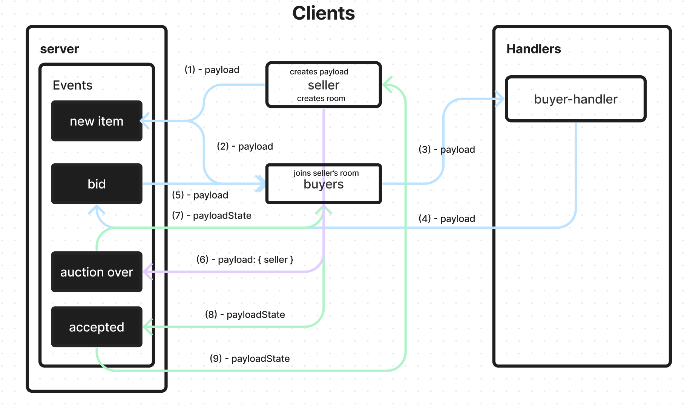

# LAB - Class 14

## Project: Auction

### Author: Jelani R

### Problem Domain

Create a new application using real-time events

Requirements
Your application must employ the following programming concepts:

- A “hub” server that moderates all events
- Multiple “clients” that connect to the hub which can both publish and subscribe to events
- Must operate over a network

I created an application that simulates an auction with an event driven architecture using Socket.io

### Links and Resources

- [GitHub Actions ci/cd](https://github.com/Jchips/auction/actions)
- [Pull Request](https://github.com/Jchips/auction/pull/1)

### Setup

#### `.env` requirements

- PORT=your-port-number

#### How to initialize/run the application

do in the following order:

- navigate to server folder
- `node server.js` in terminal to run server
- navigate to buyers folder in a second terminal tab
- `node index.js` in terminal to run buyers
- navigate to seller folder in a third terminal tab
- `node index.js` in terminal to run seller

buyers and seller terminals will quit by themselves once auction is over.

#### Features / Routes

- What was my key takeaway?

  My key takeaway is practicing what I have learned in event driven programming with Socket.io.

- Events

  - 'join' - join the seller's room
  - 'new item' - the seller is selling a new item
  - 'bid' - a new bid was made on the seller's item
  - 'auction over' - the auction has ended
  - 'accepted' - the buyer has accepted the item sold to them

- Pull requests:

    <https://github.com/Jchips/auction/pull/1>

#### Tests

- How do you run tests?
no tests

#### UML

